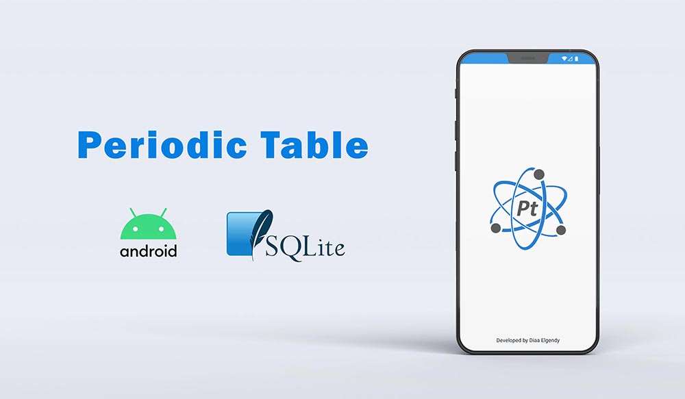
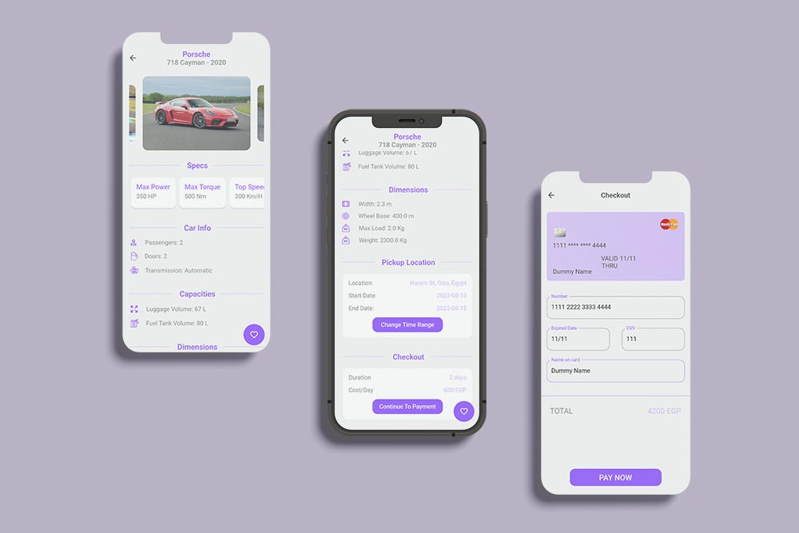

## Hi there, I'm Diaa Elgendy     ❤️ 👋
  - Experienced Flutter developer with 2+ years.
  - Graduated from faculty of Computer and information science.
  - Seeking for new challenges to apply skills and deliver innovative mobile applications.

 
## Connect with me:
  - Facebook:  https://fb.com/diaa.elgendy.5/
  - LinkedIn:   https://linkedin.com/in/diaa-elgendy-2175311b0/
  - Instagram:  https://instagram.com/diaa_elgendy
  - Email:      Diaaelgendy155@outlook.com

## Latest work:

<h3>Tabea - تابع</h3>

Tabea is an Outage Tracker app - your ultimate solution to stay informed and prepared in the face of power distruptions.
  
  

 

<h3>S&M HR System</h3>

HR Management System is a flutter application built for tracking employee activity, working hours, requesting vacations & excuses, reading announcements with cool features such as uploading attachments and files and also viewing employee profile.
  
 

 

<h3>La Vie (Orange Hackathon Project 2022)</h3>

E-commerce application for targeting users who are interested in plants. Built with BLoC using MVVM architecture.

  

 

<h3>Periodic Table</h3>

Native Android Application that describe all the elements in the periodic table in details and explain all the chemical definitions that is related to the elements.

  

 

<h3>Car2Go</h3>

Car Renatl Application.

   

 

## Languages and Tools:

             </a> <a href="https://postman.com" target="_blank" rel="noreferrer">  

